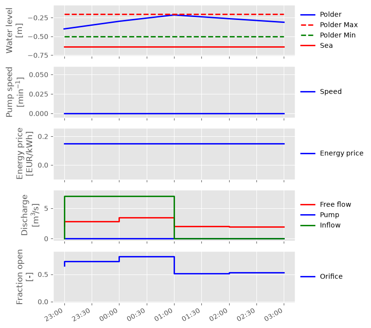
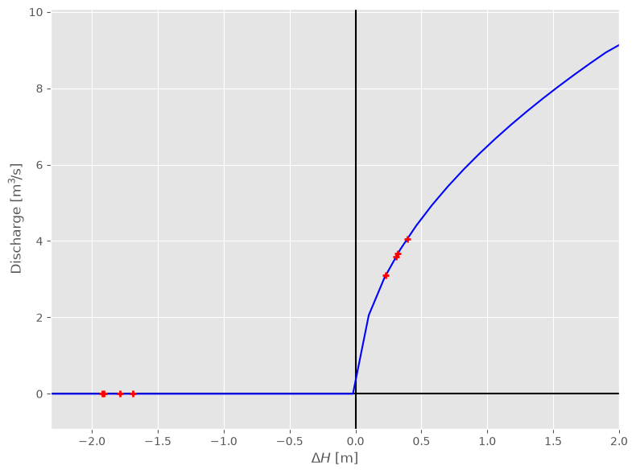

Basic Orifice
~~~~~~~~~~~~~

.. image:: ../../images/weir_linne.jpg
  :alt: https://beeldbank.rws.nl, Rijkswaterstaat / Bart van Eyck

.. :href: https://beeldbank.rws.nl/MediaObject/Details/Luchtfotoserie_van_de_stuw_in_de_Maas_nabij_Linne_23560

.. note::

  This example focuses on how to implement a controllable orifice in RTC-Tools
  using the Hydraulic Structures library. It assumes basic exposure to RTC-
  Tools. If you are a first-time user of RTC-Tools, please refer to the `RTC-Tools documentation`_.
  It also builds on the basic pumping station example, and assumes basic
  exposure to RTC-Tools and the :py:class:`~rtctools_hydraulic_structures.pumping_station_mixin.PumpingStationMixin`.
  To start with basics of pump modeling, see :doc:`../pumping_station/basic-pumping-station`.

The purpose of this example is to understand the technical setup of a model of
with a pumping station for pumping conditions, and an orifice for free flow
conditions.

The scenario of this example is roughly equal to that of :doc:`../pumping_station/basic-pumping-station`,
but with an additional orifice to let out water under free flow. The
downstream boundary condition is adjusted to clearly illustrate the behavior
of the orifice.

The orifice is valid for two flow conditions:

* Free flow (when :math:`H_{down} \le H_{up}`)
* No flow

Return flow is not supported.

.. _RTC-Tools documentation: http://rtc-tools.readthedocs.io/

The Model
---------

For this example, the model represents a typical setup for a (polder) pumping
station near tidal waters. The inflow from precipitation and seepage is
modeled as a discharge (left side), with the total surface area / volume of
storage in the polder modeled as a linear storage. The downstream water level
is assumed to not be (directly) influenced by the pumping station, and
therefore modeled as a boundary condition.

To keep the polder water level in the acceptable range, water can either be
pumped out or let out using the orifice. Operating the pumps to discharge the
water consumes power, whereas letting out water using the orifice is free. If
we minimize for power or energy consumption, we would therefore expect the
orifice to discharge as much water as possible when the downstream water level
is lower than the polder level.

The model can be viewed and edited using the OpenModelica Connection Editor
program. First load the Deltares library into OpenModelica Connection Editor,
and then load the example model, located at
``examples/orifice/basic/model/Example.mo``. The model ``Example.mo``
represents a simple water system with the following elements:

* the polder canals, modeled as storage element
  ``Deltares.ChannelFlow.Hydraulic.Storage.Linear``,
* a discharge boundary condition
  ``Deltares.ChannelFlow.Hydraulic.BoundaryConditions.Discharge``,
* a water level boundary condition
  ``Deltares.ChannelFlow.Hydraulic.BoundaryConditions.Level``,
* a pumping station
  ``MyPumpingStation`` extending ``Deltares.ChannelFlow.Hydraulic.Structures.PumpingStation.PumpingStation``
* an orifice
  ``Deltares.ChannelFlow.Hydraulic.Structures.Orifice.Orifice``

.. image:: ../../images/basic-pumping-station-omedit.png

Note it is a nested model, with the ``MyPumpingStation`` model part of the
``Example`` model. For more details on this, see :doc:`../pumping_station/basic-pumping-station`.

In text mode, the Modelica model looks as follows (with annotation statements
removed):

.. literalinclude:: ../../build/_stripped_examples/orifice/basic/model/Example.mo
  :language: modelica
  :lineno-match:

The attributes of ``orifice1`` are explained in detail in :cpp:class:`~Deltares::ChannelFlow::Hydraulic::Structures::Orifice::Orifice`.

In addition to the elements, two input variables ``pumpingstation1_pump1_Q``
and ``orifice1_Q`` are also defined, with a set of equations matching them to
their dot-equivalent (e.g. ``orifice1.Q``).

.. important::

  Because nested ``input`` symbols cannot be detected, it is necessary for the
  user to manually map this symbol to an equivalent one with dots replaced
  with underscores.

The Optimization Problem
------------------------

The python script consists of the following blocks:

* Import of packages
* Definition of water level goal
* Definition of the optimization problem class

  * Constructor
  * Passing a list of orifices
  * Passing a list of pumping stations
  * Additional configuration of the solver

* A run statement

Importing Packages
''''''''''''''''''

For this example, the import block is as follows:

.. literalinclude:: ../../../../examples/orifice/basic/src/example.py
  :language: python
  :lines: 1-12
  :lineno-match:

Water Level Goal
''''''''''''''''

Next we define our water level range goal. It reads the desired upper and
lower water levels from the optimization problem class. For more information
about how this goal maps to an objective and constraints, we refer to the
documentation of
:py:class:`~rtctools.optimization.goal_programming_mixin.StateGoal`.

.. literalinclude:: ../../../../examples/orifice/basic/src/example.py
  :language: python
  :pyobject: WaterLevelRangeGoal
  :lineno-match:

Optimization Problem
''''''''''''''''''''

Then we construct the optimization problem class by declaring it and
inheriting the desired parent classes. Note that we are importing both
``PumpingStationMixin`` and ``OrificeMixin``. The order of inheritance of
these two classes does not matter.

.. literalinclude:: ../../../../examples/orifice/basic/src/example.py
  :language: python
  :pyobject: Example
  :lineno-match:
  :end-before: """

Now we define our orifice and pumping station objects, and store them in a
local instance variable. We refer to this instance variable from the abstract
method ``orifices()`` and ``pumping_stations()`` we have to override.

.. literalinclude:: ../../../../examples/orifice/basic/src/example.py
  :language: python
  :pyobject: Example.__init__
  :lineno-match:
  :start-after: output_folder

.. literalinclude:: ../../../../examples/orifice/basic/src/example.py
  :language: python
  :pyobject: Example.orifices
  :lineno-match:

Then we append our water level range goal and minimization goals, just like in
:doc:`../pumping_station/basic-pumping-station`.

Run the Optimization Problem
''''''''''''''''''''''''''''

To make our script run, at the bottom of our file we just have to call
the ``run_optimization_problem()`` method we imported on the optimization
problem class we just created.

.. literalinclude:: ../../../../examples/orifice/basic/src/example.py
  :language: python
  :lineno-match:
  :start-after: # Run

The Whole Script
''''''''''''''''

All together, the whole example script is as follows:

.. literalinclude:: ../../../../examples/orifice/basic/src/example.py
  :language: python
  :lineno-match:

Results
-------

The results from the run are found in ``output/timeseries_export.csv``. Any
CSV reading software can import it.

The ``post()`` method in our ``Example`` class also generates a generates some
pictures to help understand what is going on.

First we have an overview of the relevant boundary conditions and control
variables.

As expressed in the introduction of this example problem, we indeed see that
the orifice is letting out as much water as possible, with it being fully open
at all times it can be.

Using
:py:func:`~rtctools_hydraulic_structures.orifice_mixin.plot_operating_points`
it is possible to generate a H-Q plot of the orifice's operating points, such
as  shown below. Here we see that all operating points are on the line
signifying the discharge-head relationship when the orifice is fully opened.

