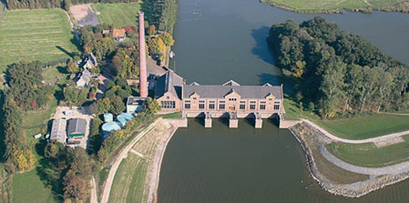
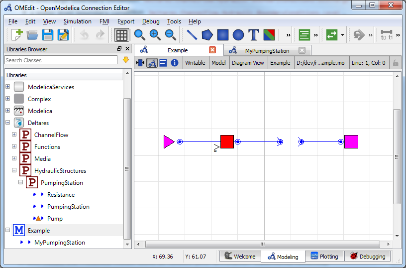
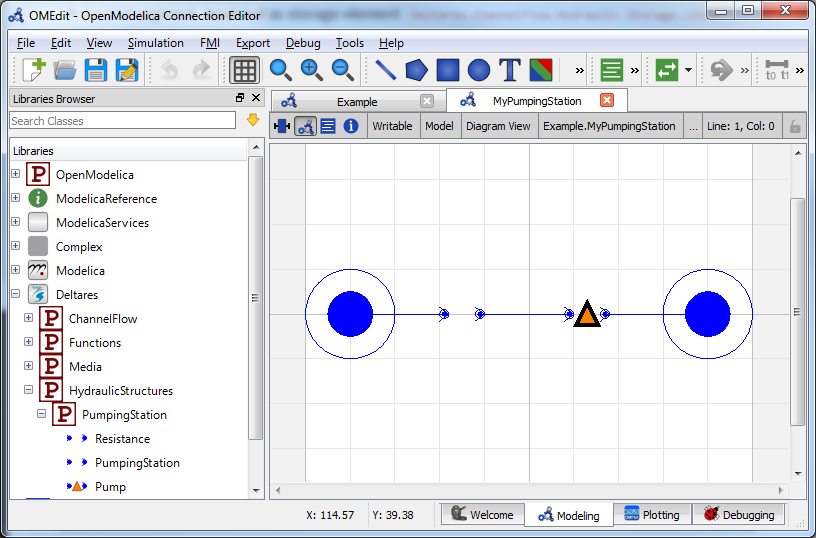
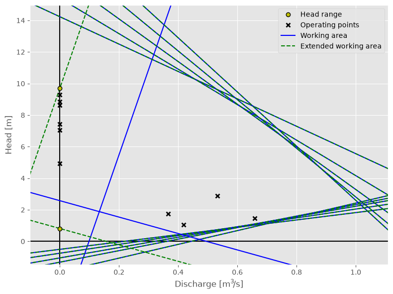

Basic Pumping Station
~~~~~~~~~~~~~~~~~~~~~

.. :href: https://commons.wikimedia.org/wiki/File:Woudagemaal.jpg
.. content is released under a CC0 Public Domain licence - no attribution needed

.. note::

  This example focuses on how to implement optimization for pumping stations
  in RTC-Tools using the Hydraulic Structures library. It assumes basic
  exposure to RTC-Tools. If you are a first-time user of RTC-Tools, please
  refer to the `RTC-Tools documentation`_.

The purpose of this example is to understand the technical setup of a model
with the Hydraulic Structures Pumping Station object, how to run the model,
and how to interpret the results.

The scenario is the following: A pumping station with a single pump is trying
to keep an upstream polder in an allowable water level range. Downstream of
the pumping station is a sea with a (large) tidal range, but the sea level
never drops below the polder level. Any pump must be on or off for at least a
predetermined amount of time. The price on the energy market fluctuates, and
the goal of the operator is to keep the polder water level in the allowable
range while minimizing the pumping costs.

The folder ``examples/pumping_station/basic`` contains the complete RTC-Tools
optimization problem.

.. _RTC-Tools documentation: http://rtc-tools.readthedocs.io/

The Model
---------

For this example, the model represents a typical setup for a polder pumping station in
lowland areas. The inflow from precipitation and seepage is modeled as a
discharge (left side), with the total surface area / volume of storage in the
polder modeled as a linear storage. The downstream water level is assumed to
not be (directly) influenced by  the pumping station, and therefore modeled as
a boundary condition.

Operating the pumps to discharge the water in the polder consumes power, which
varies based on the head difference and total flow. In general, the lower the
head difference or discharge, the lower the power needed to pump water.

The expected result is therefore that the model computes a control pattern
that makes use of these tidal and energy fluctuations, pumping water when the
sea water level is low and/or energy is cheap. It is also expected that as
little water as necessary is pumped, i.e. the storage available in the polder
is used to its fullest. Concretely speaking this means that the water level at
the last time step will be very close (or equal) to the maximum water level.

The model can be viewed and edited using the OpenModelica Connection Editor
program. First load the Deltares library into OpenModelica Connection Editor,
and then load the example model, located at
``examples/pumping_station/basic/model/Example.mo``. The model ``Example.mo``
represents a simple water system with the following elements:

* the polder canals, modeled as storage element
  ``Deltares.ChannelFlow.Hydraulic.Storage.Linear``,
* a discharge boundary condition
  ``Deltares.ChannelFlow.Hydraulic.BoundaryConditions.Discharge``,
* a water level boundary condition
  ``Deltares.ChannelFlow.Hydraulic.BoundaryConditions.Level``,
* a pumping station
  ``MyPumpingStation`` extending ``Deltares.ChannelFlow.Hydraulic.Structures.PumpingStation.PumpingStation``

Note it is a nested model. In other words, we have defined our own ``MyPumpingStation`` model, which is in itself part of the ``Example`` model. You can add classes (e.g. models) to an existing model in the OpenModelica Editor by right clicking your current model (e.g. ``Example``) --> ``New Modelica Class``. Make sure to extend the ``Deltares.ChannelFlow.Hydraulic.Structures.PumpingStation.PumpingStation`` class.

If we navigate into our nested MyPumpingStation model, we have the following elements:

* our single pump
  ``Deltares.ChannelFlow.Hydraulic.Structures.PumpingStation.Pump``,
* a resistance
  ``Deltares.ChannelFlow.Hydraulic.Structures.PumpingStation.Resistance``,

In text mode, the Modelica model looks as follows (with annotation statements
removed):

.. literalinclude:: ../../build/_stripped_examples/pumping_station/basic/model/Example.mo
  :language: modelica
  :lineno-match:

The attributes of ``pump1`` are explained in detail in :cpp:class:`~Deltares::ChannelFlow::Hydraulic::Structures::PumpingStation::Pump`.

In addition to the elements, two input variables ``pumpingstation1_pump1_Q``
and ``pumpingstation1_resistance1_dH`` are also defined, with a set of
equations matching them to their dot-equivalent (e.g.
``pumpingstation1.pump1.Q``).

.. important::

  Because nested ``input`` symbols cannot be detected, it is necessary for the
  user to manually map this symbol to an equivalent one with dots replaced
  with underscores.

The Optimization Problem
------------------------

The python script consists of the following blocks:

* Import of packages
* Definition of water level goal
* Definition of the optimization problem class

  * Constructor
  * Passing a list of pumping stations
  * Additional configuration of the solver

* A run statement

Importing Packages
''''''''''''''''''

For this example, the import block is as follows:

.. literalinclude:: ../../../../examples/pumping_station/basic/src/example.py
  :language: python
  :lines: 1-10
  :lineno-match:

Note that we are importing both ``PumpingStationMixin`` and ``PumpingStation``
from ``rtctools_hydraulic_structures.pumping_station_mixin``.

Water Level Goal
''''''''''''''''

Next we define our water level range goal. It reads the desired upper and
lower water levels from the optimization problem class. For more information
about how this goal maps to an objective and constraints, we refer to the
documentation of
:py:class:`~rtctools.optimization.goal_programming_mixin.StateGoal`.

.. literalinclude:: ../../../../examples/pumping_station/basic/src/example.py
  :language: python
  :pyobject: WaterLevelRangeGoal
  :lineno-match:

Optimization Problem
''''''''''''''''''''

Then we construct the optimization problem class by declaring it and
inheriting the desired parent classes.

.. literalinclude:: ../../../../examples/pumping_station/basic/src/example.py
  :language: python
  :pyobject: Example
  :lineno-match:
  :end-before: """

Now we define our pumping station objects, and store them in a local instance
variable. We refer to this instance variable from the abstract method
``pumping_stations()`` we have to override.

.. literalinclude:: ../../../../examples/pumping_station/basic/src/example.py
  :language: python
  :pyobject: Example.__init__
  :lineno-match:
  :start-after: output_folder

.. literalinclude:: ../../../../examples/pumping_station/basic/src/example.py
  :language: python
  :pyobject: Example.pumping_stations
  :lineno-match:

Then we append our water level range goal to the list of path goals from our
parents classes:

.. literalinclude:: ../../../../examples/pumping_station/basic/src/example.py
  :language: python
  :pyobject: Example.path_goals
  :lineno-match:

We also add a minimization goal for the costs, which has a default priority of
``sys.maxsize``. This goal will automatically integrate the product of power
and energy price for all pumps in all pumping stations,

.. literalinclude:: ../../../../examples/pumping_station/basic/src/example.py
  :language: python
  :pyobject: Example.goals
  :lineno-match:

Finally, we want to apply some additional configuration, reducing the amount of
information the solver outputs:

.. literalinclude:: ../../../../examples/pumping_station/basic/src/example.py
  :language: python
  :pyobject: Example.solver_options
  :lineno-match:

Run the Optimization Problem
''''''''''''''''''''''''''''

To make our script run, at the bottom of our file we just have to call
the ``run_optimization_problem()`` method we imported on the optimization
problem class we just created.

.. literalinclude:: ../../../../examples/pumping_station/basic/src/example.py
  :language: python
  :lineno-match:
  :start-after: # Run

The Whole Script
''''''''''''''''

All together, the whole example script is as follows:

.. literalinclude:: ../../../../examples/pumping_station/basic/src/example.py
  :language: python
  :lineno-match:

Results
-------

The results from the run are found in ``output/timeseries_export.xml``. Any
PI-XML-reading software can import it.

The ``post()`` method in our ``Example`` class also generates some pictures to
help understand what is going on.

First we have an overview of the relevant boundary conditions and control
variables.

.. image:: ../../../../examples/pumping_station/basic/reference_output/overall_results.png

As expressed in the introduction of this example problem, we indeed see that
the available buffer in the polder is used to its fullest. The water level at
the final time step is (almost) equal to the maximum water level.

In this example, no historical data regarding the pump history is provided.
Thus there is no prescribed behavior for the pump status on the initial time
steps.

Furthermore, we see that the pump only discharges water when the water level
is low. It is interesting to see that the optimal solution for costs means
pumping at the lowest water level, even though the energy price is twice as
high.

Using :py:func:`~rtctools_hydraulic_structures.pumping_station_mixin.plot_operating_points`
it is possible to generate a Q-H plot of the pump's working area and operating
points, such as shown below. Here we see that the pumping at lower heads
occurs with relatively large discharges, meaning that the pump is sometimes
operating close to the edges of its working area.

