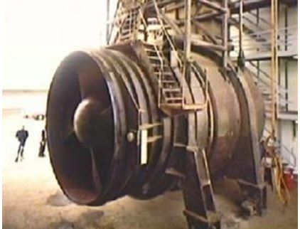
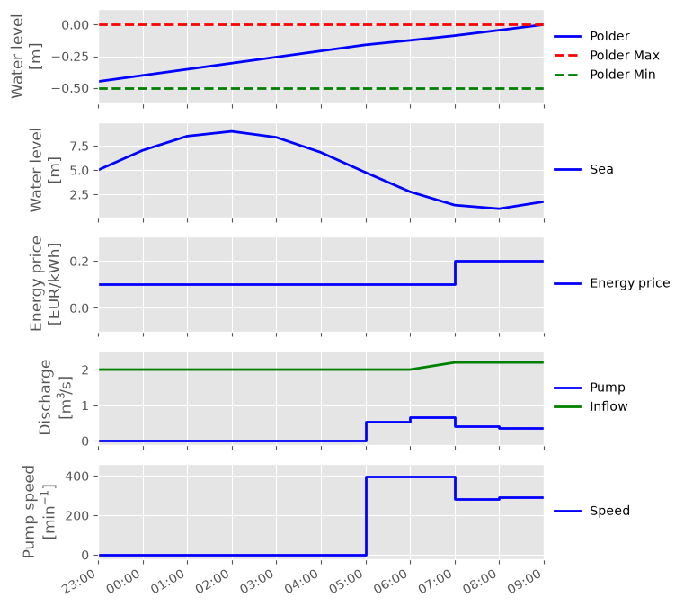
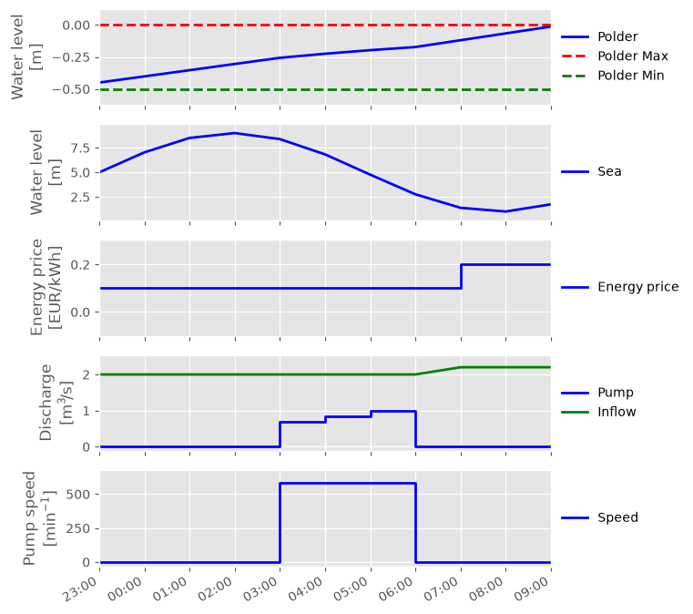
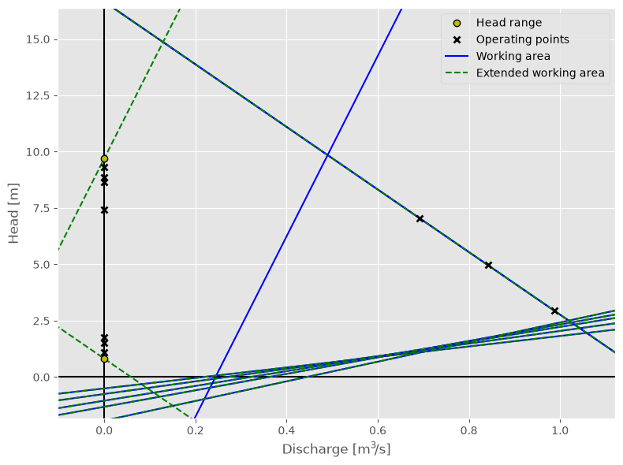

Constant speed pump
~~~~~~~~~~~~~~~~~~~

   IJmuiden in de montage hal in afwachting van het terug plaatsen in de pompschacht

.. note::

  This example focuses on how to model a constant speed pump, and
  assumes basic exposure to RTC-Tools and the :py:class:`~rtctools_hydraulic_structures.pumping_station_mixin.PumpingStationMixin`.
  To start with basics of pump modeling, see :doc:`basic-pumping-station`.

The purpose of this example is to understand the technical setup of a model
of a constant speed pump.

The scenario of this example is equal to that of :doc:`basic-pumping-station`,
but with one constant speed pump instead of a variable speed pump. The
resistance has also been removed. The folder
``examples/pumping_station/two_pumps`` contains the complete RTC- Tools
optimization problem. The discussion below will focus on the differences from
the :doc:`basic-pumping-station`.

.. note::

   The resistance has been removed because it created an artificial head loss
   to be able to pump at lower power energy prices.

The Model
---------

The constant speed pump is modeled the same way as the variable speed one.
The difference is the working area and the power approximation. This can
be seen in the file ``Example.mo``:

.. literalinclude:: ../../build/_stripped_examples/pumping_station/constant_speed_pump/model/Example.mo
  :language: modelica
  :lines: 8-26
  :lineno-match:

The interpretation and the calculation of these coefficients is explained in
:doc:`../../modelica-api`. For constant speed pumps, the polynomial that defines the minimum and maximum
speed is the same.

The Optimization Problem
------------------------

The optimization problem is exactly the same as for a variable speed pump.

Results
-------

The same example is calculated with a variable and a constant speed pump. The constant
speed pump's speed is equal to the maximum speed of the variable speed pump. The results with the
variable speed pump

and the constant speed pump are shown below.

It can be seen that the constant speed pump was trying in a shorter time but pumping higher
discharge. In this situation the constant speed pump therefore using three times more
energy.

In the Q-H plot of the operating points we clearly see the pump operating on
the linearized maximum pump speed line.

