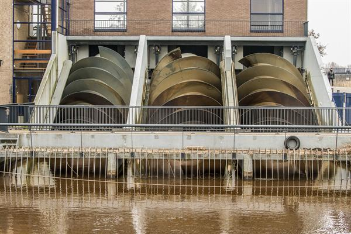
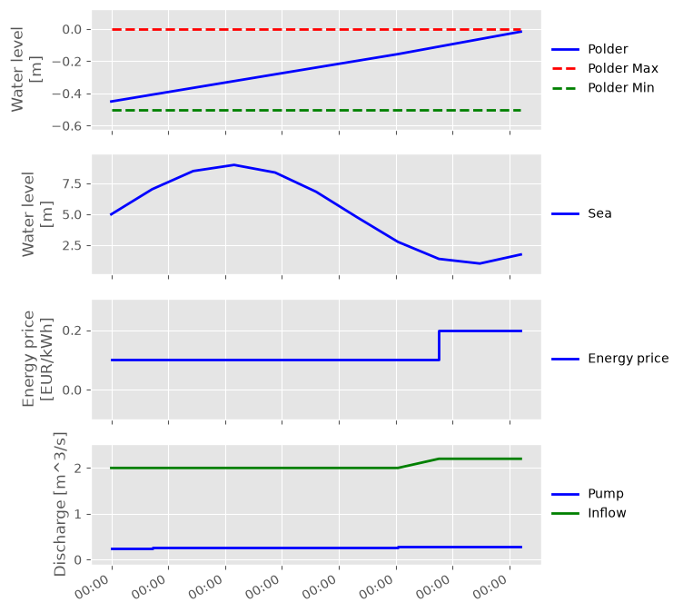
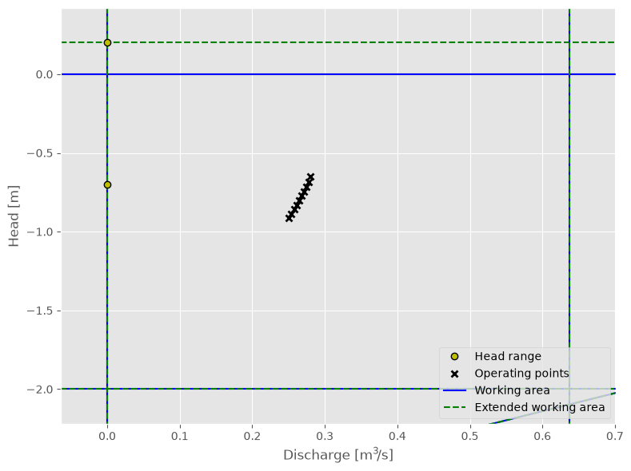

Screw pump
~~~~~~~~~~~~~~~~~~~

.. note::

  This example focuses on how to model a screw pump, and
  assumes basic exposure to RTC-Tools and the :py:class:`~rtctools_hydraulic_structures.pumping_station_mixin.PumpingStationMixin`.
  To start with basics of pump modeling, see :doc:`basic-pumping-station`.

The purpose of this example is to understand the technical setup of a model
of a screw speed pump.

The scenario of this example is equal to that of :doc:`basic-pumping-station`,
but with one constant speed pump instead of a variable speed pump. The folder
``examples/pumping_station/screw_pump`` contains the complete RTC- Tools
optimization problem. The discussion below will focus on the differences from
the :doc:`basic-pumping-station`.

.. note::

   The screw pump is tested with working area falling in the region when the discharge does
   not change with the head any more (when the pump is full). The other regions are not tested.

The Model
---------

The screw pump is modeled the same way as the variable speed one. The coefficients
approximating the power, speed and working are should be obtained from the pump 
curves, just like for the other type of pumps. The main difference is that the 
power of the screw-pump depends on the upstream head, but it does not depend on 
the downstream one. Therefore the ``head_option`` should be set to -1 in the 
modelica file, see ``Example.mo``:

.. literalinclude:: ../../build/_stripped_examples/pumping_station/constant_speed_pump/model/Example.mo
  :language: modelica
  :lines: 8-35
  :lineno-match:

The interpretation and the calculation of these coefficients is explained in
:doc:`../../modelica-api`. For constant speed pumps, the polynomial that defines the minimum and maximum
speed is the same.

The Optimization Problem
------------------------

The optimization problem is exactly the same as for a variable speed pump.

Results
-------

The results with the screw pump can be seen:

In the Q-H plot of the operating points we clearly see the pump operating on
the linearized maximum pump speed line.

