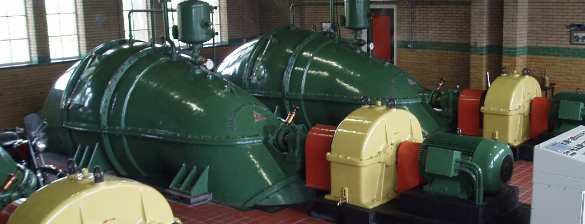
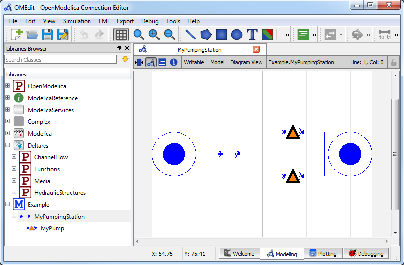
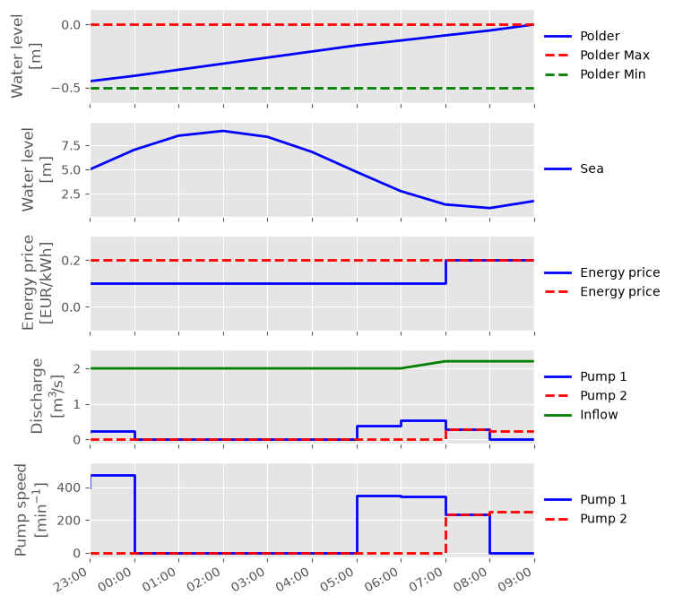

Two Pumps
~~~~~~~~~

.. note::

  This example focuses on how to put multiple pumps in a hydraulic model, and
  assumes basic exposure to RTC-Tools and the :py:class:`~rtctools_hydraulic_structures.pumping_station_mixin.PumpingStationMixin`.
  To start with basics of pump modeling, see :doc:`basic-pumping-station`.

The purpose of this example is to understand the technical setup of a model
with multiple pumps.

The scenario of this example is similar to that of :doc:`basic-pumping-station`
with the following exceptions:

- there are two available pumps instead of one;
- each pump has its associated price of energy;
- from historical data we know that ``pump1`` has been on during the two previous hours.

The folder ``examples/pumping_station/two_pumps`` contains the complete RTC- Tools
optimization problem. The discussion below will focus on the differences from
the :doc:`basic-pumping-station`.

The Model
---------

The pumping station object ``MyPumpingStation`` looks as follows in its
diagram representation in OpenModelica:

When modeling multiple pumps of the same type, it makes sense to define a
model, which can then be instantiated into multiple objects. In the file
``Example.mo`` this can be seen in the submodel ``MyPump`` of
``MyPumpingStation``:

.. literalinclude:: ../../build/_stripped_examples/pumping_station/two_pumps/model/Example.mo
  :language: modelica
  :lines: 8-26
  :lineno-match:

The data of this pump is exactly equal to that used in :doc:`basic-pumping-station`,
but is not instantiated yet. To instantiate two pumps using this
data, we define two components ``pump1`` and ``pump2``:

.. literalinclude:: ../../build/_stripped_examples/pumping_station/two_pumps/model/Example.mo
  :language: modelica
  :lines: 33-34
  :lineno-match:

Lastly, it is important not to forget to set the right number of pumps on the
pumping station object:

.. literalinclude:: ../../build/_stripped_examples/pumping_station/two_pumps/model/Example.mo
  :language: modelica
  :lines: 3-6
  :lineno-match:

The Optimization Problem
------------------------

When using multiple pumps it is important to specify the right order of pumps.
This order should match the order of pumps in the
:cpp:var:`~Deltares::ChannelFlow::Hydraulic::Structures::PumpingStation::PumpingStation::pump_switching_matrix`.
The parameter ``energy_price_symbol`` is used to specify the energy price of each pump in the pumping station.
This is either a string or a list of strings of names of the energy prices time series.
If ``energy_price_symbol`` is a string, then all the pumps of the pumping station will have the same energy price.
Else there must be as many energy price symbols as number of pumps.

.. literalinclude:: ../../../../examples/pumping_station/two_pumps/src/example.py
  :language: python
  :pyobject: Example.__init__
  :lineno-match:
  :start-after: output_folder

Results
------------------------

We give an overview of the results.

As mentioned we assume that ``pump1`` has been on for the two previous hours,
so it must be on for at least one more hour. This explains why it is
on in the first time step. Beside that, the pumps discharge water when the water
level is low even though the energy price is higher during that time frame.