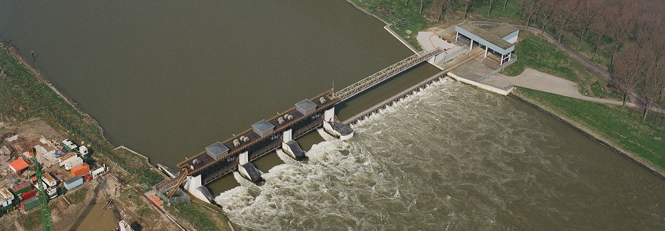
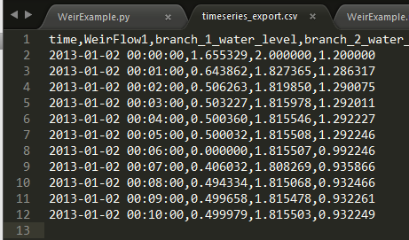
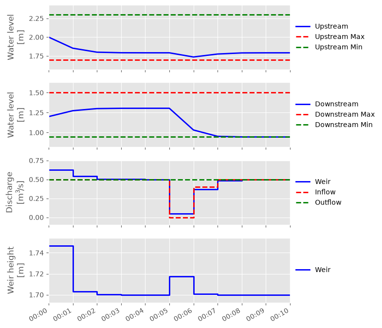
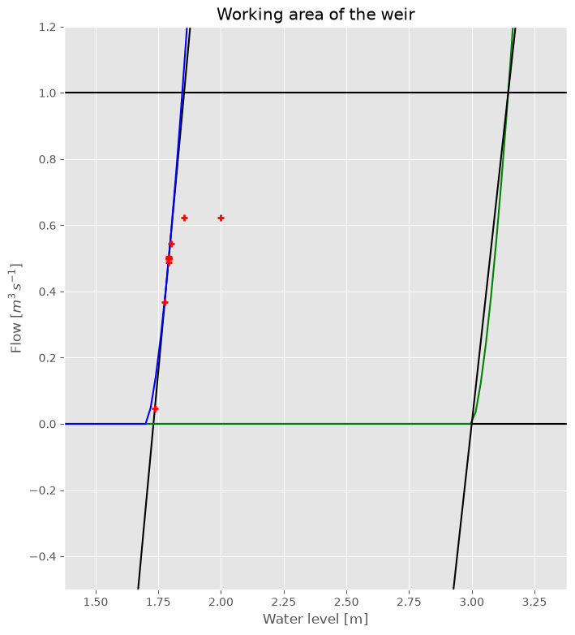

Basic Weir
~~~~~~~~~~

.. :href: https://beeldbank.rws.nl/MediaObject/Details/Luchtfotoserie_van_de_stuw_in_de_Maas_nabij_Linne_23560

.. note::

  This example focuses on how to implement a controllable weir in RTC-Tools
  using the Hydraulic Structures library. It assumes basic exposure to RTC-
  Tools. If you are a first-time user of RTC-Tools, please refer to the
  `RTC-Tools documentation`_.

The weir structure is valid for two flow conditions:

* Free (critical) flow
* No flow

.. warning::

  Submerged flow is not supported.

.. _RTC-Tools documentation: http://rtc-tools.readthedocs.io/

Modeling
--------

Building a model with a weir
^^^^^^^^^^^^^^^^^^^^^^^^^^^^

In this example we are considering a system of two branches and a controllable
weir in between. On the upstream side is a prescribed input flow, and on the
downstream side is a prescribed output flow. The weir should move in such way
that the water level in both branches is kept within the desired limits.

To build this model, we need the following blocks:
 * upstream and downstream discharge boundary conditions
 * two branches
 * a weir

By putting the blocks from the Modelica editor, the code is automatically generated
(Note: this code snippet excludes the lines about the annotation and location):

.. literalinclude:: ../../build/_stripped_examples/weir/basic/model/WeirExample.mo
  :language: modelica
  :start-after: output
  :end-before: equation
  :lineno-match:

For the weir block, the dimensions of the weir should be set. It can be done either by double
clicking to the block, or in the text editor.
A controllable weir is represented with a weir block. This block has discharge and water level as input,
and also as output. When a block is placed, the following parameters can be given:

- ``width``: the width of the crest in meters
- ``hw_min``: the minimum crest height
- ``hw_max``: the maximum crest height
- ``q_min``: the minimum expected discharge
- ``q_max``: the maximum expected discharge

.. warning::
    The values of ``q_min`` ``q_max`` and should be estimated in such a way 
    that the discharge will not be able to go outside these bounds.
    However, for some linearization purposes, they should be as tight as possible.
    The choice of these values has considerable influence on the performance of the weir.
    It is good practice to look at the results after the optimization, and if the actual maximum discharge
    is much lower than the maximum discharge bound set by the user, the discharge
    bound should be reduced. Also, a similar statement is true for the minimum discharge.
    For example, if it is known that there is always water flowing over the weir, the
    minimum discharge should be bigger than zero. The values look like the line above.

The input variables are the upstream and downstream
(known) discharges. The control variable - the variable that the algorithm changes until it achieves the
desired results - is the discharge between the two branches. In practice, the weir height is the variable
that we are interested in, but as it depends on the discharge between the two branches
and the upstream water level, it will only be calculated in post processing.
The input variables for the model are:

.. literalinclude:: ../../build/_stripped_examples/weir/basic/model/WeirExample.mo
  :language: modelica
  :start-after: model
  :end-before: output
  :lineno-match:

.. important::

  The min, max and nominal the values should always be meaningful. For
  nominal, set the value that the variable most likely takes.

As output, we are interested in the water level in the two branches:

.. literalinclude:: ../../build/_stripped_examples/weir/basic/model/WeirExample.mo
  :language: modelica
  :lines: 5-6
  :lineno-match:

Now we have to define the equations. We have to set the boundary conditions. First the discharge should be read
from the external files:

.. literalinclude:: ../../build/_stripped_examples/weir/basic/model/WeirExample.mo
  :language: modelica
  :lines: 21-22
  :lineno-match:

And then the water level should be defined equal to the water level in the branch:

.. literalinclude:: ../../build/_stripped_examples/weir/basic/model/WeirExample.mo
  :language: modelica
  :lines: 17-18
  :lineno-match:

As we use reservoirs for branches, the variables we do not need should be zero:

.. literalinclude:: ../../build/_stripped_examples/weir/basic/model/WeirExample.mo
  :language: modelica
  :lines: 19-20
  :lineno-match:

Finally the outputs are set:

.. literalinclude:: ../../build/_stripped_examples/weir/basic/model/WeirExample.mo
  :language: modelica
  :lines: 24-25
  :lineno-match:

and the control variable as well:

.. literalinclude:: ../../build/_stripped_examples/weir/basic/model/WeirExample.mo
  :language: modelica
  :lines: 23
  :lineno-match:

The whole model file looks like this:

.. literalinclude:: ../../build/_stripped_examples/weir/basic/model/WeirExample.mo
  :language: modelica
  :lineno-match:

Optimization
------------

In this example, we would like to achieve that the water levels in the branches stay in the prescribed
limits. The easiest way to achieve this objective is through goal programming. We will define two goals,
one goal for each branch. The goal is that the water level should be higher than the given minimum and
lower than the given maximum. Any solution satisfying these criteria is equally attractive for us.
In practice, in goal programming the goal violation value is taken to the order’th power in the objective function
(see: `Goal Programming <http://rtc-tools.readthedocs.io/en/latest/optimization/multi_objective.html>`_).
In our example, we use the file ``WeirExample.py``. We define a class, and apart from the usual classes
that we import for optimization problems, we also have to import the class ``WeirMixin``:

.. literalinclude:: ../../../../examples/weir/basic/src/example.py
  :language: python
  :pyobject: WeirExample
  :end-before: weir1
  :lineno-match:

Now we have to define the weirs: in quotation marks should be the same name as used for the Modelica model.
Now there is only one weir, and the definition looks like:

.. literalinclude:: ../../../../examples/weir/basic/src/example.py
  :language: python
  :pyobject: WeirExample.__init__
  :lineno-match:
  :start-after: super
  :end-before: output_folder

In case of more weirs, the names can be separated with a comma, for example::

        self.__weirs = [Weir(self, 'weir1'), Weir(self, 'weir2')]

Lastly we have to override the abstract method the returns the list of weirs:

.. literalinclude:: ../../../../examples/weir/basic/src/example.py
  :language: python
  :pyobject: WeirExample.weirs
  :lineno-match:

Adding goals
^^^^^^^^^^^^

In this example there are two branches connected with a weir. On the upstream
side is a prescribed input flow, and on the downstream side is a prescribed
output flow. The weir should move in such way, that the water level in both
branches kept within the desired limits. We can add a water level goal for the
upstream branch:

.. literalinclude:: ../../../../examples/weir/basic/src/example.py
  :language: python
  :pyobject: WLRangeGoal_01
  :lineno-match:

A similar goal can be added to the downstream branch.

Setting the solver
^^^^^^^^^^^^^^^^^^

As it is a mixed integer problem, it is handy to set some options to control
the solver. In this example, we set the ``allowable_gap`` to 0.005. It is used
to specify the value of absolute gap under which the algorithm stops. This is
larger than the default. This gives lower expectations for the acceptable
solution, and in this way, the time of iteration is less. This value might be
different for every problem and might be adjusted a trial-and-error basis. For
more information, see the documentation of the `BONMIN solver User\'s Manual
<https://www.coin-or.org/Bonmin/option_pages/options_list_bonmin.html>`_)

The solver setting is the following:

.. literalinclude:: ../../../../examples/weir/basic/src/example.py
  :language: python
  :pyobject: WeirExample.solver_options
  :lineno-match:

Input data
^^^^^^^^^^

In order to run the optimization, we need to give the boundary conditions and the water level bounds.
This data is given as time-series in the file ``timeseries_import.csv``.

The whole python file
^^^^^^^^^^^^^^^^^^^^^

The optimization file looks like:

.. literalinclude:: ../../../../examples/weir/basic/src/example.py
  :language: python
  :lineno-match:

Results
-------

After successful optimization the results are printed in the time series export file. After running this example,
the following results are expected:

The file found in the example folder includes some visualization routines.

Interpretation of the results
-----------------------------

The results of this simulation are summarized in the following figure:

In this example, the input flow increases after 6 minutes, while the
downstream flow is kept constant. While the inflow drops after 6 minutes, the
result is not seen in the upstream branch, because the weir moves up to
compensate it. After the weir moved up, the water level drops in the
downstream branch.

Using :py:func:`~rtctools_hydraulic_structures.weir_mixin.plot_operating_points`
it is possible to generate a Q-H plot of the weir's working area and
operating points, such as shown below. Here we see that it would have been
possible to choose a slightly lower upper bound for the working area, to
include more of the possible working area in the lower left corner. We also
see that the weir tends to operate almost entirely on the left edge of the
working area, i.e. at the lowest possible head difference.

