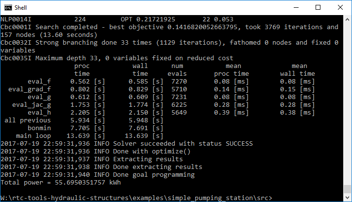

###############
Getting Started
###############

Installation
============

Installation of the RTC-Tools Hydraulic Structures library is as simple as::

    # 1. Use pip and PyPI to install
    pip install rtc-tools-hydraulic-structures

RTC-Tools Hydraulic Structures depends on `RTC-Tools <https://gitlab.com/deltares/rtc-tools.git>`_
and its `ChannelFlow <https://gitlab.com/deltares/rtc-tools-channel-flow.git>`_ library,
which are automatically installed as dependencies.

The Modelica library is installed in a hard to access location to make sure
RTC-Tools can find it. If you want to load the library in an editor like
OpenModelica, it is best to run `rtc-tools-copy-libraries`. See also
:ref:`the RTC-Tools documentation <rtctools:getting-started-copy-libraries>` on this.

Running an example
==================

To make sure that everything is set-up correctly, you can run one of the
example cases. These do not come with the installation, and need to be downloaded separately::

    # 1. Clone the repository
    git clone https://gitlab.com/deltares/rtc-tools-hydraulic-structures.git

    # 2. Change directory to the example folder
    cd rtc-tools-hydraulic-structures/examples/pumping_station/basic/src

    # 3. Run the example
    python example.py

You will see the progress of RTC-Tools in your shell. If all is well, you
should see something like the following output.

Contribute
==========

You can contribute to this code through Pull Request on GitLab_. Please, make
sure that your code is coming with unit tests to ensure full coverage and
continuous integration in the API.

.. _GitLab: https://gitlab.com/deltares/rtc-tools-hydraulic-structures/merge_requests
