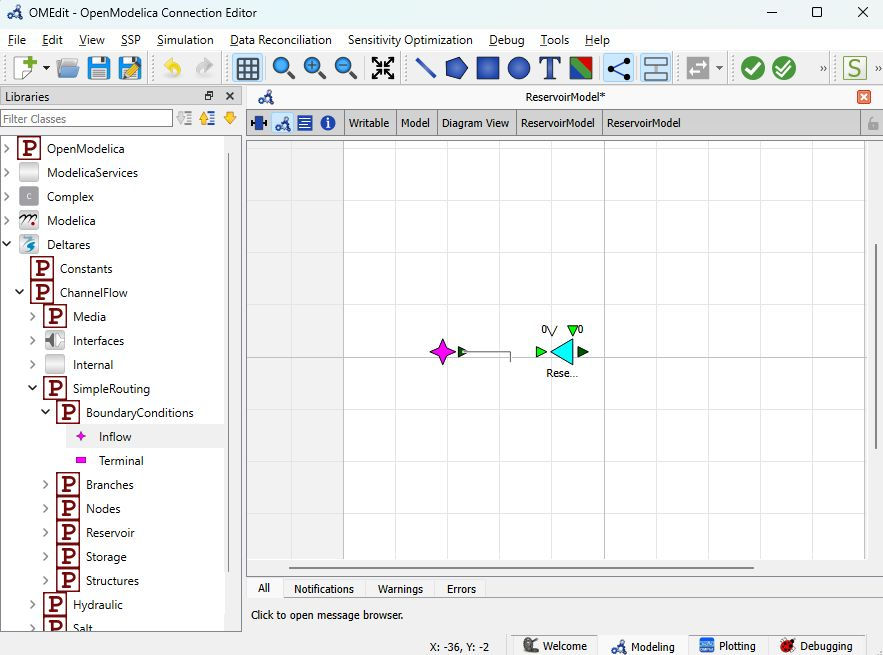
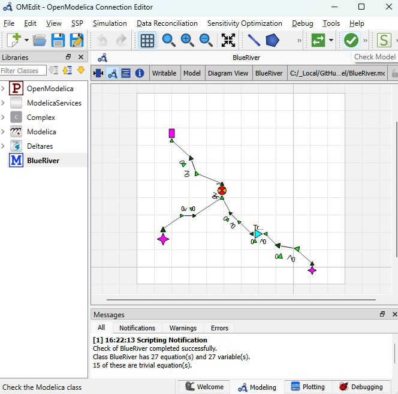

Usage
=====

.. _installation:

Installation
------------

The RTC-Tools channel flow library can be installed with pip:

.. code-block:: console

   (.venv) $ pip install rtc-tools-channel-flow

Open Modelica Connection Editor
-------------------------------

A Modelica editor
^^^^^^^^^^^^^^^^^

RTC-Tools uses the Modelica language to describe the mathematics of the system we wish to optimize or simulate. There are several editors for Modelica models, but the `OpenModelica Connection Editor <https://openmodelica.org/free-and-open-source-software/omconnectioneditoromedit/>`_, or OMEdit, is a free and open-source graphical connection editor that can be used to construct RTC-Tools models.

Build a model schematization
^^^^^^^^^^^^^^^^^^^^^^^^^^^^

A model schematization can be composed from building blocks from the Deltares library via drag-and-drop. The model objects are connected with the help of the mouse:

Validating a model
^^^^^^^^^^^^^^^^^^

With the "Check model" feature, OMEdit allows to check the model for syntax errors. Furthermore, the model check reveals if the model produces a balanced equation system. In the example below, the "Check model" output in the Messages window shows a balanced equation system with 27 equations and 27 variables for a simple reservoir system. On the left, different libraries are shown: standard Modelica libraries, the Deltares library, and the model of the reservoir system "BlueRiver". 

Display model object names
^^^^^^^^^^^^^^^^^^^^^^^^^^

To display the name of a model object, use the ``annotation`` statement. The example below is taken from the ``partial class Reservoir``, found within ``Deltares.ChannelFlow.Internal``::

  annotation(Icon(coordinateSystem( initialScale = 0.1, grid = {10, 10}), graphics = {Polygon(fillColor = {0, 255, 255}, fillPattern = FillPattern.Solid, points = {{40, 50}, {-45, 0}, {40, -50}, {40, 50}, {40, 50}}), Text(origin = {0, -80}, extent = {{-70, 20}, {70, -20}}, textString = "%name", fontName = "MS Shell Dlg 2")})); .

How to build RTC-Tools models with the RTC-Tools channel flow library
---------------------------------------------------------------------
Examples of RTC-Tools models that use the channel flow library can be found in the `RTC-Tools documentation <https://rtc-tools.readthedocs.io/>`_.

Modelica supports if-then-else commands. For RTC-Tools models, Modelica if-then-else statements must not be used, because an equation system is not differentiable if it contains if-then-else logic. 

